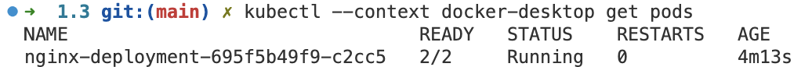
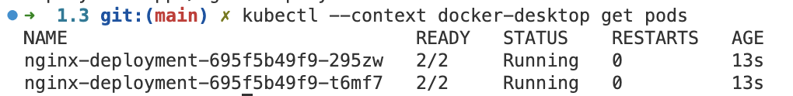
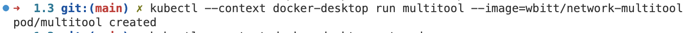
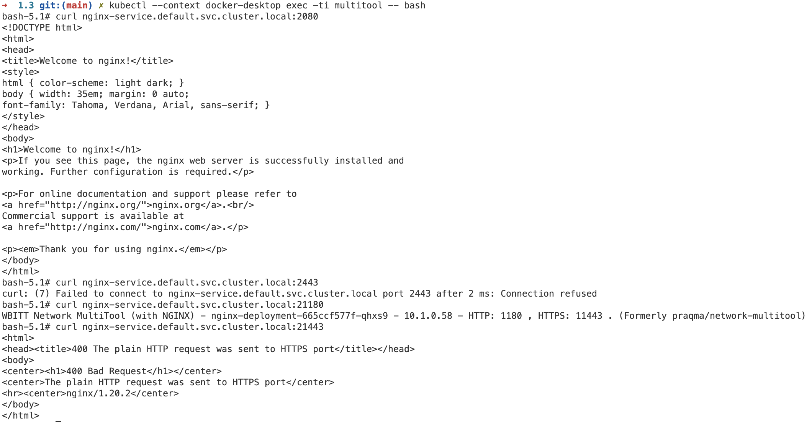

# Домашнее задание к занятию «Запуск приложений в K8S»

### Цель задания

В тестовой среде для работы с Kubernetes, установленной в предыдущем ДЗ, необходимо развернуть Deployment с приложением, состоящим из нескольких контейнеров, и масштабировать его.

------

### Чеклист готовности к домашнему заданию

1. Установленное k8s-решение (например, MicroK8S).
2. Установленный локальный kubectl.
3. Редактор YAML-файлов с подключённым git-репозиторием.

------

### Инструменты и дополнительные материалы, которые пригодятся для выполнения задания

1. [Описание](https://kubernetes.io/docs/concepts/workloads/controllers/deployment/) Deployment и примеры манифестов.
2. [Описание](https://kubernetes.io/docs/concepts/workloads/pods/init-containers/) Init-контейнеров.
3. [Описание](https://github.com/wbitt/Network-MultiTool) Multitool.

------

### Задание 1. Создать Deployment и обеспечить доступ к репликам приложения из другого Pod

1. Создать Deployment приложения, состоящего из двух контейнеров — nginx и multitool. Решить возникшую ошибку.
2. После запуска увеличить количество реплик работающего приложения до 2.
3. Продемонстрировать количество подов до и после масштабирования.
4. Создать Service, который обеспечит доступ до реплик приложений из п.1.
5. Создать отдельный Pod с приложением multitool и убедиться с помощью `curl`, что из пода есть доступ до приложений из п.1.

------

### Ответ
Я создал приложение из двух контейнеров в одном поде. Ошибка возникала из-за того, что оба этих контейнера пытались слушать 80 и 443 порты. Решил ошибку определением энвов HTTP_PORT и HTTP_PORTS для мультитула на другие порты. 
Вот количество подов до масштабирования:


Вот количество подов после масштабирования:


Создал service и обновил деплоймент, доступ до реплик появился

Создал отдельный под с мультитулом


Доступ до сервиса есть


Файл с деплойментом: https://github.com/RamiresHab/kuber-homeworks/blob/main/1.3/deployment.yaml

------

### Задание 2. Создать Deployment и обеспечить старт основного контейнера при выполнении условий

1. Создать Deployment приложения nginx и обеспечить старт контейнера только после того, как будет запущен сервис этого приложения.
2. Убедиться, что nginx не стартует. В качестве Init-контейнера взять busybox.
3. Создать и запустить Service. Убедиться, что Init запустился.
4. Продемонстрировать состояние пода до и после запуска сервиса.

------

### Ответ

Создаём deployment-2.yaml в котором помимо контейнера с nginx будет описан init контейнер на основе busybox с ожиданием нашего сервиса nginx-service2

контейнер не запускается, так как Service не существует

Создал Service

Init запуотработалстился, контейнер nginx, так как service создался

```
Name:                   nginx-deployment2
Namespace:              default
CreationTimestamp:      Fri, 28 Jul 2023 01:59:48 +0200
Labels:                 app=nginx-deployment2
Annotations:            deployment.kubernetes.io/revision: 1
Selector:               app=nginx-deployment2
Replicas:               1 desired | 1 updated | 1 total | 1 available | 0 unavailable
StrategyType:           RollingUpdate
MinReadySeconds:        0
RollingUpdateStrategy:  25% max unavailable, 25% max surge
Pod Template:
  Labels:  app=nginx-deployment2
  Init Containers:
   delay:
    Image:      busybox
    Port:       <none>
    Host Port:  <none>
    Command:
      sh
      -c
      until nslookup nginx-service2.default.svc.cluster.local; do echo waiting for nginx-service2; sleep 2; done;
    Environment:  <none>
    Mounts:       <none>
  Containers:
   nginx:
    Image:        nginx
    Port:         80/TCP
    Host Port:    0/TCP
    Environment:  <none>
    Mounts:       <none>
  Volumes:        <none>
Conditions:
  Type           Status  Reason
  ----           ------  ------
  Available      True    MinimumReplicasAvailable
  Progressing    True    NewReplicaSetAvailable
OldReplicaSets:  <none>
NewReplicaSet:   nginx-deployment2-58cb7746b4 (1/1 replicas created)
Events:
  Type    Reason             Age   From                   Message
  ----    ------             ----  ----                   -------
  Normal  ScalingReplicaSet  12s   deployment-controller  Scaled up replica set nginx-deployment2-58cb7746b4 to 1


Name:              nginx-service2
Namespace:         default
Labels:            <none>
Annotations:       <none>
Selector:          app=nginx-deployment2
Type:              ClusterIP
IP Family Policy:  SingleStack
IP Families:       IPv4
IP:                10.98.164.47
IPs:               10.98.164.47
Port:              http-nginx  3080/TCP
TargetPort:        80/TCP
Endpoints:         10.1.0.161:80
Session Affinity:  None
Events:            <none>
```

Файл с деплойментом: https://github.com/RamiresHab/kuber-homeworks/blob/main/1.3/deployment-2.yaml

------

### Правила приема работы

1. Домашняя работа оформляется в своем Git-репозитории в файле README.md. Выполненное домашнее задание пришлите ссылкой на .md-файл в вашем репозитории.
2. Файл README.md должен содержать скриншоты вывода необходимых команд `kubectl` и скриншоты результатов.
3. Репозиторий должен содержать файлы манифестов и ссылки на них в файле README.md.

------
