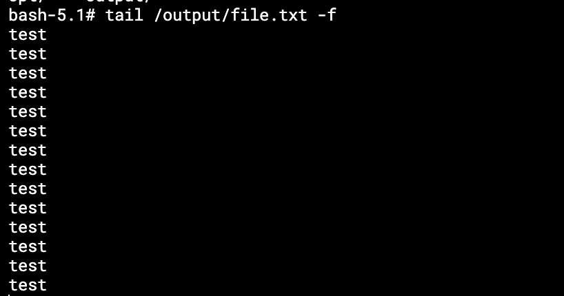
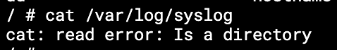
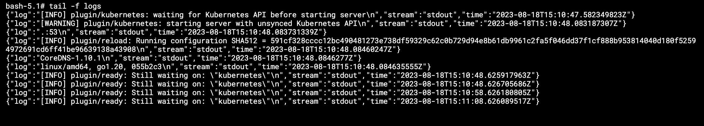

# Домашнее задание к занятию «Хранение в K8s. Часть 1»

------

### Задание 1 

**Что нужно сделать**

Создать Deployment приложения, состоящего из двух контейнеров и обменивающихся данными.

1. Создать Deployment приложения, состоящего из контейнеров busybox и multitool.
2. Сделать так, чтобы busybox писал каждые пять секунд в некий файл в общей директории.
3. Обеспечить возможность чтения файла контейнером multitool.
4. Продемонстрировать, что multitool может читать файл, который периодоически обновляется.
5. Предоставить манифесты Deployment в решении, а также скриншоты или вывод команды из п. 4.

------

### Ответ

Файл с деплойментом приложения: https://github.com/RamiresHab/kuber-homeworks/blob/main/2.1/deployment-2.1.yaml

Busibox контейнер запускается с аргументами, поэтому он пишет в общий volume каждые пять секунд.

```
args: ['while sleep 5; do echo "test" >> /input/file.txt; done']
```

Multitool контейнер имеет доступ до этого файла, так как этот же volume примонтирован к нему 

```
        volumeMounts:
        - name: vol
          mountPath: /output
```

Скриншот чтения контейнером multitool файла из общего volume в режиме реального времени


------

### Задание 2

**Что нужно сделать**

Создать DaemonSet приложения, которое может прочитать логи ноды.

1. Создать DaemonSet приложения, состоящего из multitool.
2. Обеспечить возможность чтения файла `/var/log/syslog` кластера MicroK8S.
3. Продемонстрировать возможность чтения файла изнутри пода.
4. Предоставить манифесты Deployment, а также скриншоты или вывод команды из п. 2.

------

### Ответ

Ссылка на daemonset приложения: https://github.com/RamiresHab/kuber-homeworks/blob/main/2.1/daemonset-2.1.yaml

На моей ноде /var/log/syslog это пустой каталог, а не файл, поэтому я примонтировал другой файл


```
        ...
        volumeMounts:
        - name: vol
          mountPath: /logs
          readOnly: true
      volumes:
        - name: vol
          hostPath:
            path: /var/log/pods/kube-system_coredns-5d78c9869d-zx9x2_5ccc715b-07c2-43b9-a137-67113b4d6dc0/coredns/20.log
```


Возможность чтения примонтированного файла ноды изнутри пода


------

### Правила приёма работы

1. Домашняя работа оформляется в своём Git-репозитории в файле README.md. Выполненное задание пришлите ссылкой на .md-файл в вашем репозитории.
2. Файл README.md должен содержать скриншоты вывода необходимых команд `kubectl`, а также скриншоты результатов.
3. Репозиторий должен содержать тексты манифестов или ссылки на них в файле README.md.

------