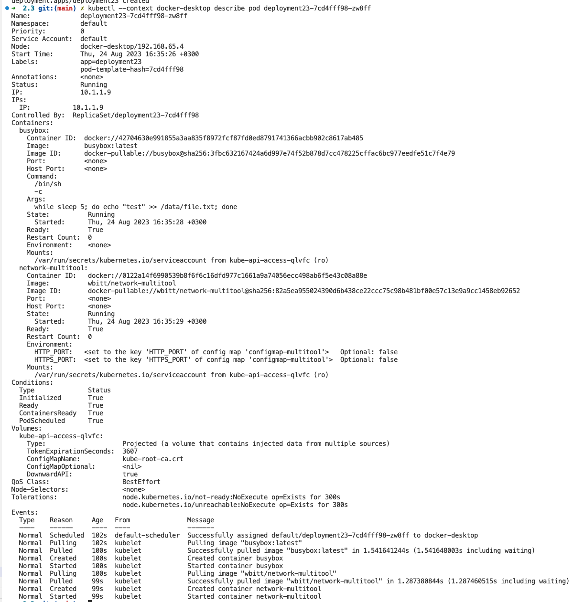
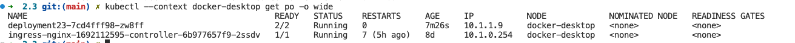
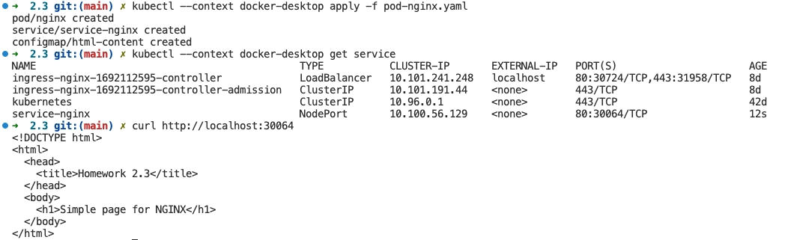
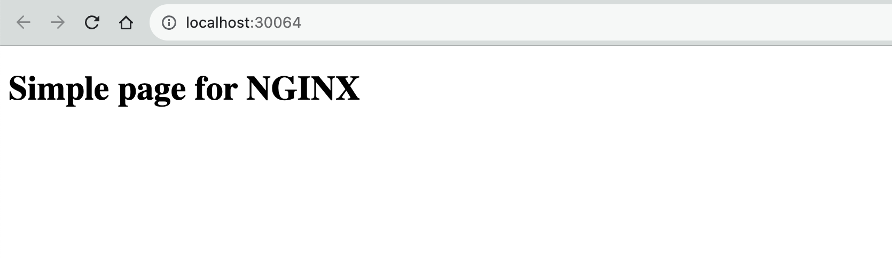
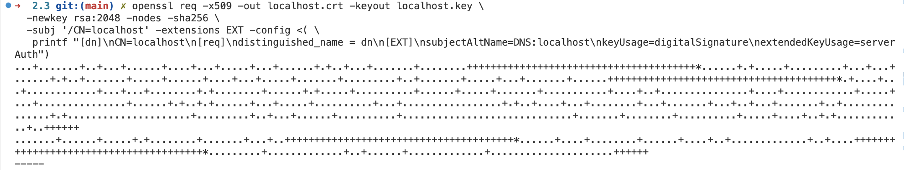
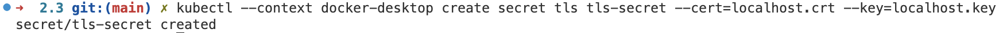
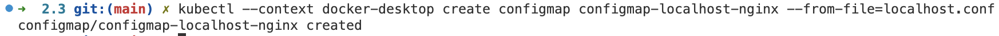
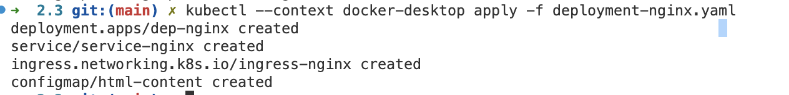
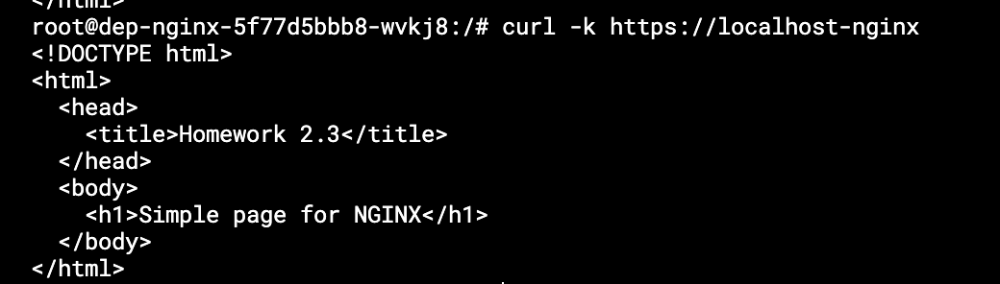

# Домашнее задание к занятию «Конфигурация приложений»

------

### Задание 1. Создать Deployment приложения и решить возникшую проблему с помощью ConfigMap. Добавить веб-страницу

1. Создать Deployment приложения, состоящего из контейнеров busybox и multitool.
2. Решить возникшую проблему с помощью ConfigMap.
3. Продемонстрировать, что pod стартовал и оба конейнера работают.
4. Сделать простую веб-страницу и подключить её к Nginx с помощью ConfigMap. Подключить Service и показать вывод curl или в браузере.
5. Предоставить манифесты, а также скриншоты или вывод необходимых команд.

------

### Решение

Файл с деплойментом: https://github.com/RamiresHab/kuber-homeworks/blob/main/2.3/deployment-2.3.yaml

Оба контейнера в поде одновременно не поднимаются, так как пытаются слушать одни и те же порты: 80 и 443. Мы можем сделать congigmap, где задать другие порты через env для multitool.

После того, как мы сделали apply configmap и добавили configmap в deployment, контейнеры в поде запустились.

Файл с манифестами пода,  сервиса и конфигмапа: https://github.com/RamiresHab/kuber-homeworks/blob/main/2.3/pod-nginx.yaml

После запуска пода, сервиса и конфигмапа мы можем получить доступ к странице через курл и браузер

------

### Задание 2. Создать приложение с вашей веб-страницей, доступной по HTTPS 

1. Создать Deployment приложения, состоящего из Nginx.
2. Создать собственную веб-страницу и подключить её как ConfigMap к приложению.
3. Выпустить самоподписной сертификат SSL. Создать Secret для использования сертификата.
4. Создать Ingress и необходимый Service, подключить к нему SSL в вид. Продемонстировать доступ к приложению по HTTPS. 
4. Предоставить манифесты, а также скриншоты или вывод необходимых команд.

------

### Решение

Выпустим самоподписанный ключ и сертификат для localhost

Создадим секрет

Создадим файл с конфигом nginx для localhost: https://github.com/RamiresHab/kuber-homeworks/blob/main/2.3/localhost.conf

Создадим configmap из этого файла

Файл с манифестами деплоймента, сервиса ингреса и конфигмапа для localhost: https://github.com/RamiresHab/kuber-homeworks/blob/main/2.3/deployment-nginx.yaml

Применяем деплоймент

Доступ к приложению по https

------

### Правила приёма работы

1. Домашняя работа оформляется в своём GitHub-репозитории в файле README.md. Выполненное домашнее задание пришлите ссылкой на .md-файл в вашем репозитории.
2. Файл README.md должен содержать скриншоты вывода необходимых команд `kubectl`, а также скриншоты результатов.
3. Репозиторий должен содержать тексты манифестов или ссылки на них в файле README.md.

------