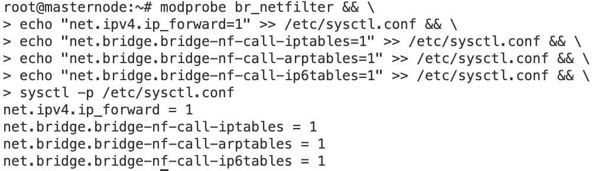

# Домашнее задание к занятию «Установка Kubernetes»

-----

### Задание 1. Установить кластер k8s с 1 master node

1. Подготовка работы кластера из 5 нод: 1 мастер и 4 рабочие ноды.
2. В качестве CRI — containerd.
3. Запуск etcd производить на мастере.
4. Способ установки выбрать самостоятельно.

------

### Решение

#### Сгенерируем ключи 


#### Создадим мастер ноду


#### Отключим swap 
```
sudo swapoff -a
sudo vi /etc/fstab
```
Закомментируем строку
```
#UUID=be2c7c06-cc2b-4d4b-96c6-e3700932b129 /               ext4    errors=remount-ro 0       1
```
#### Воспользуемся коммандами из инструкции 
```
sudo mkdir -p 0755 /etc/apt/keyrings && \
sudo apt-get update && \
sudo apt-get install -y apt-transport-https ca-certificates curl && \
curl -fsSL https://packages.cloud.google.com/apt/doc/apt-key.gpg | sudo gpg --dearmor -o /etc/apt/keyrings/kubernetes-archive-keyring.gpg && \
echo "deb [signed-by=/etc/apt/keyrings/kubernetes-archive-keyring.gpg] https://apt.kubernetes.io/ kubernetes-xenial main" | sudo tee /etc/apt/sources.list.d/kubernetes.list && \
sudo apt-get update && \
sudo apt-get install -y kubelet kubeadm kubectl containerd && \
sudo apt-mark hold kubelet kubeadm kubectl containerd
```
#### Включаем forwarding.  



#### Инициализируем мастер ноду
```
kubeadm init \
--apiserver-advertise-address=10.128.0.20 \
--pod-network-cidr 10.244.0.0/16 \
--apiserver-cert-extra-sans=51.250.66.88

```


#### Настраиваем kubectl для работы под своим пользователем 

```
mkdir -p $HOME/.kube
sudo cp -i /etc/kubernetes/admin.conf $HOME/.kube/config
sudo chown $(id -u):$(id -g) $HOME/.kube/config
```
#### Проверим, что API получает наши команды


#### Устанавливаем CNI


#### Теперь наш статус изменился


#### Смотрим вывод `kubectl describe nodes masternode`  


#### Создаём четрыре workernode, повторяем все шаги, а так же выполняем команду которая была сгенерирована после инициализации мастера


```
kubeadm join 10.128.0.20:6443 --token fsicpf.xn6280k2soyxydkf \
        --discovery-token-ca-cert-hash sha256:11fde04b3e122bbadc511c2f88219d8c63e272d420142b95a33f4497e6eaefc3 
```


Все ноды добавлены в кластер


## Дополнительные задания (со звёздочкой)

**Настоятельно рекомендуем выполнять все задания под звёздочкой.** Их выполнение поможет глубже разобраться в материале.   
Задания под звёздочкой необязательные к выполнению и не повлияют на получение зачёта по этому домашнему заданию. 

------
### Задание 2*. Установить HA кластер

1. Установить кластер в режиме HA.
2. Использовать нечётное количество Master-node.
3. Для cluster ip использовать keepalived или другой способ.

### Правила приёма работы

1. Домашняя работа оформляется в своем Git-репозитории в файле README.md. Выполненное домашнее задание пришлите ссылкой на .md-файл в вашем репозитории.
2. Файл README.md должен содержать скриншоты вывода необходимых команд `kubectl get nodes`, а также скриншоты результатов.
3. Репозиторий должен содержать тексты манифестов или ссылки на них в файле README.md.