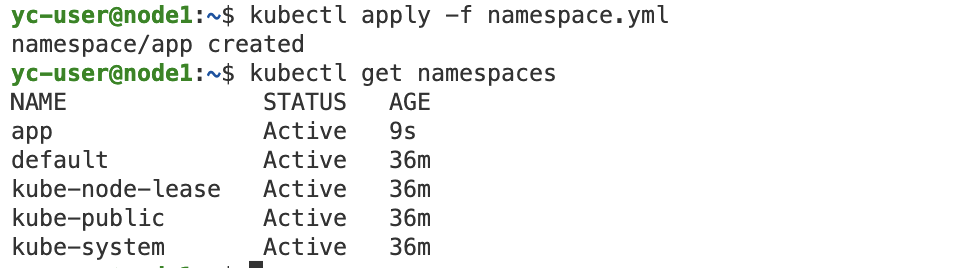

# Домашнее задание к занятию «Как работает сеть в K8s»

-----

### Задание 1. Создать сетевую политику или несколько политик для обеспечения доступа

1. Создать deployment'ы приложений frontend, backend и cache и соответсвующие сервисы.
2. В качестве образа использовать network-multitool.
3. Разместить поды в namespace App.
4. Создать политики, чтобы обеспечить доступ frontend -> backend -> cache. Другие виды подключений должны быть запрещены.
5. Продемонстрировать, что трафик разрешён и запрещён.

### Правила приёма работы

1. Домашняя работа оформляется в своём Git-репозитории в файле README.md. Выполненное домашнее задание пришлите ссылкой на .md-файл в вашем репозитории.
2. Файл README.md должен содержать скриншоты вывода необходимых команд, а также скриншоты результатов.
3. Репозиторий должен содержать тексты манифестов или ссылки на них в файле README.md.

-----

### Решение

Подготовим кластер

Создадим namespace app

Запустим деплойменты

Запустим сервисы

Проверяем поды

Бэк и кэш доступны из пода фронта

Применим запрещающую политику

Бэк и кэш недоступны из пода фронта

Применим network policies

Подключимся к поду фронта, есть доступ до бэка и нет доступа до кэша

Подключимся к поду бэка, есть доступ до фронта и кэша

Подключимся к поду кэша, есть доступ до бэка и нет доступа до фронта

