# Домашнее задание к занятию Troubleshooting

-----

### Задание. При деплое приложение web-consumer не может подключиться к auth-db. Необходимо это исправить

1. Установить приложение по команде:
```shell
kubectl apply -f https://raw.githubusercontent.com/netology-code/kuber-homeworks/main/3.5/files/task.yaml
```
2. Выявить проблему и описать.
3. Исправить проблему, описать, что сделано.
4. Продемонстрировать, что проблема решена.

-----

### Решение

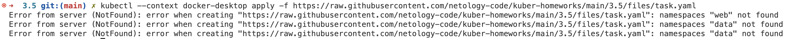

В нашем кластере нет неймспейсов web и data, но в манифесте они есть. Создадим их.

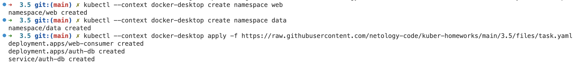

Посмотрим поды в этих неймспейсах

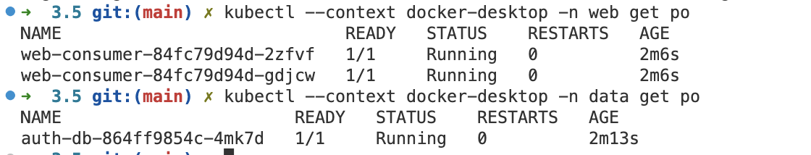

Посмотрим на логи приложения web-consumer, оно не может подключиться к auth-db

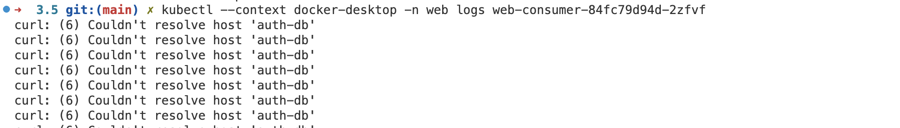

Узнаем IP этого сервиса

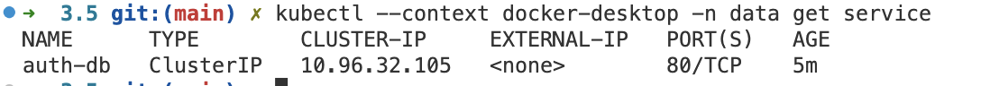

Подключимся к контейнеру с приложением web-consumer и попробуем подключиться к auth-db из него

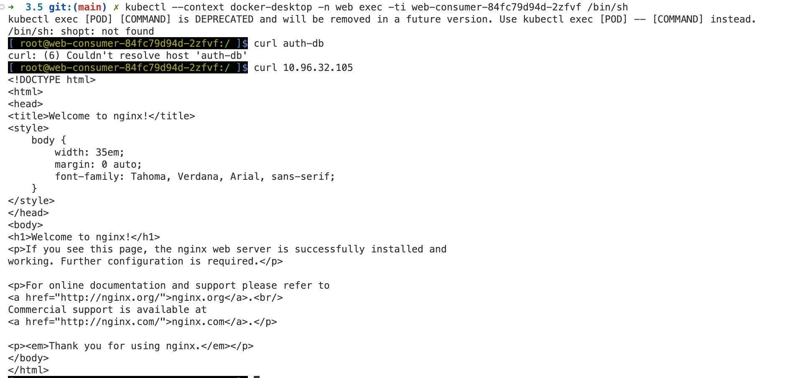

Сетевая связность есть, но не происходит резолва имени auth-db, потому что web-consumer не знает такого хоста. Отредактируем манифест и заменим **auth-db** на **auth-db.data**, про который знает CoreDNS  

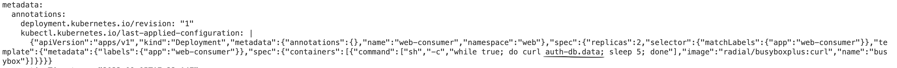

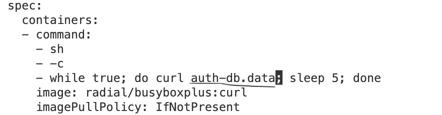

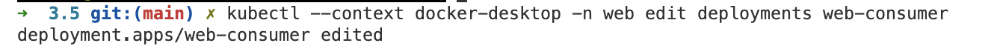

После изменения деплоймента поды перезагрузились

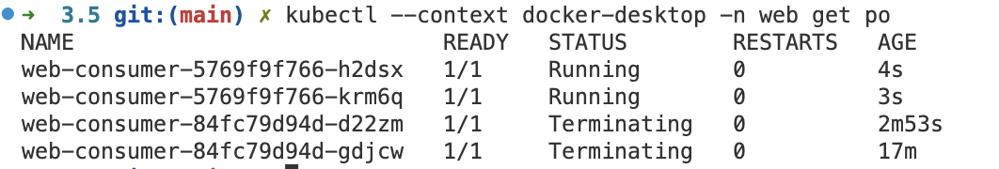

Смотрим в логи нового пода

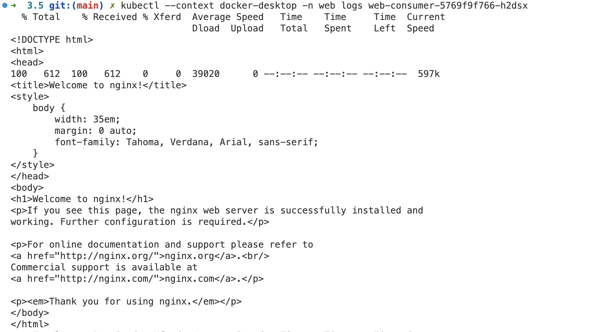

Доступ к сервису появился, мы решили проблему

-----

### Правила приёма работы

1. Домашняя работа оформляется в своём Git-репозитории в файле README.md. Выполненное домашнее задание пришлите ссылкой на .md-файл в вашем репозитории.
2. Файл README.md должен содержать скриншоты вывода необходимых команд, а также скриншоты результатов.
3. Репозиторий должен содержать тексты манифестов или ссылки на них в файле README.md.